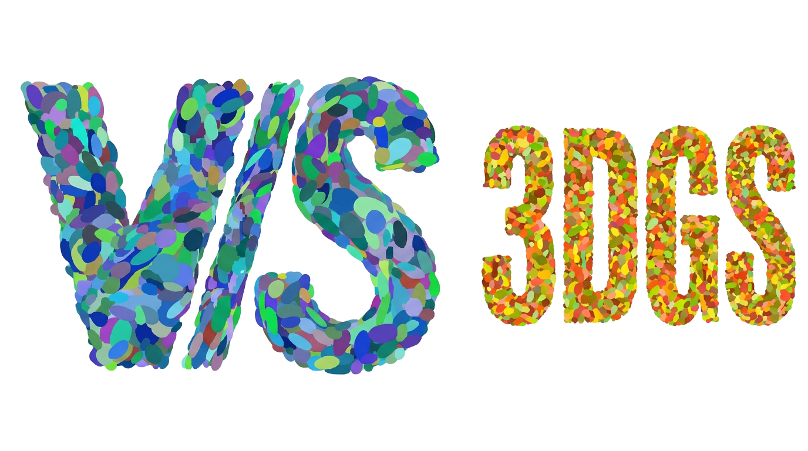

<div align="center">
  
</div>

# ViS-3DGS Viewer

A robust VSCode extension providing native viewing capabilities for 3D Gaussian Splat files (`.ply`, `.splat`, `.gsplat`).

## Overview
ViS-3DGS integrates a high-performance web-based 3D scene renderer seamlessly into the Visual Studio Code editor. By leveraging the Custom Editor API, it enables developers to visualize point-cloud structured splat files with zero external dependencies instantly upon clicking them in the file explorer.

### Features
- Native support for large `.ply` and `.splat` formats.
- High-performance chunk-stream fallbacks.
- Memory-safe extraction to avoid standard V8 limits.
- Orbit controls and GPU-acceleration out of the box.
- Includes an example `.ply` file at `media/funko.ply`.

## Building, Packaging & Installation
The extension isolates the compiled source and packaged `.vsix` into the `dist/` directory.

### 1. Compile the Source Code

```bash
# Compiles the TypeScript/JS assets exactly into the `dist/extension.js` file
npm run build 
```

### 2. Package the Extension

```bash
# Packages the extension into a standalone installable `.vsix` archive
npm run package
```

### 3. Install the Extension
Once the `npm run package` command finishes, you will find `vis-3dgs-viewer.vsix` physically separated inside the `builds/` directory.

To install it locally in VSCode:
```bash
code --install-extension builds/vis-3dgs-viewer.vsix --force
```
After installation, simply click on any `.ply`, `.splat`, or `.gsplat` file within your editor to automatically launch the 3D Viewer!

## References & Attributions
This extension heavily leverages the architecture and implementations from the following open-source projects:

- **SuperSplat**: The underlying powerful 3D viewer rendering technology. [SuperSplat via PlayCanvas](https://github.com/playcanvas/supersplat)
- **GaussianViewer**: The integration bridge logic that ties SuperSplat smoothly into VSCode's WebView architecture. [GaussianViewer](https://github.com/reagan99/GaussianViewer)

### BibTeX

```bibtex
@misc{ViS3DGSViewer,
  author = {Batuhan Ozcomlekci},
  title = {ViS-3DGS Viewer: A VSCode Extension for 3D Gaussian Splats},
  year = {2026},
  publisher = {GitHub},
  journal = {GitHub repository},
  howpublished = {\url{https://github.com/bozcomlekci/ViS-3DGS}}
}
```

If you use this viewer in academic research, please consider citing the original works that make it possible:
```
@misc{GaussianViewer2024,
  author = {reagan99},
  title = {GaussianViewer: A VSCode Extension for 3D Gaussian Splats},
  year = {2024},
  publisher = {GitHub},
  journal = {GitHub repository},
  howpublished = {\url{https://github.com/reagan99/GaussianViewer}}
}

@misc{SuperSplat2024,
  author = {PlayCanvas},
  title = {SuperSplat: 3D Gaussian Splatting editor and viewer},
  year = {2024},
  publisher = {GitHub},
  journal = {GitHub repository},
  howpublished = {\url{https://github.com/playcanvas/supersplat}}
}

@article{kerbl3Dgaussians,
  author       = {Kerbl, Bernhard and Kopanas, Georgios and Leimk{\"u}hler, Thomas and Drettakis, George},
  title        = {3D Gaussian Splatting for Real-Time Radiance Field Rendering},
  journal      = {ACM Transactions on Graphics},
  number       = {4},
  volume       = {42},
  month        = {July},
  year         = {2023},
  url          = {https://repo-sam.inria.fr/fungraph/3d-gaussian-splatting/}
}
```
